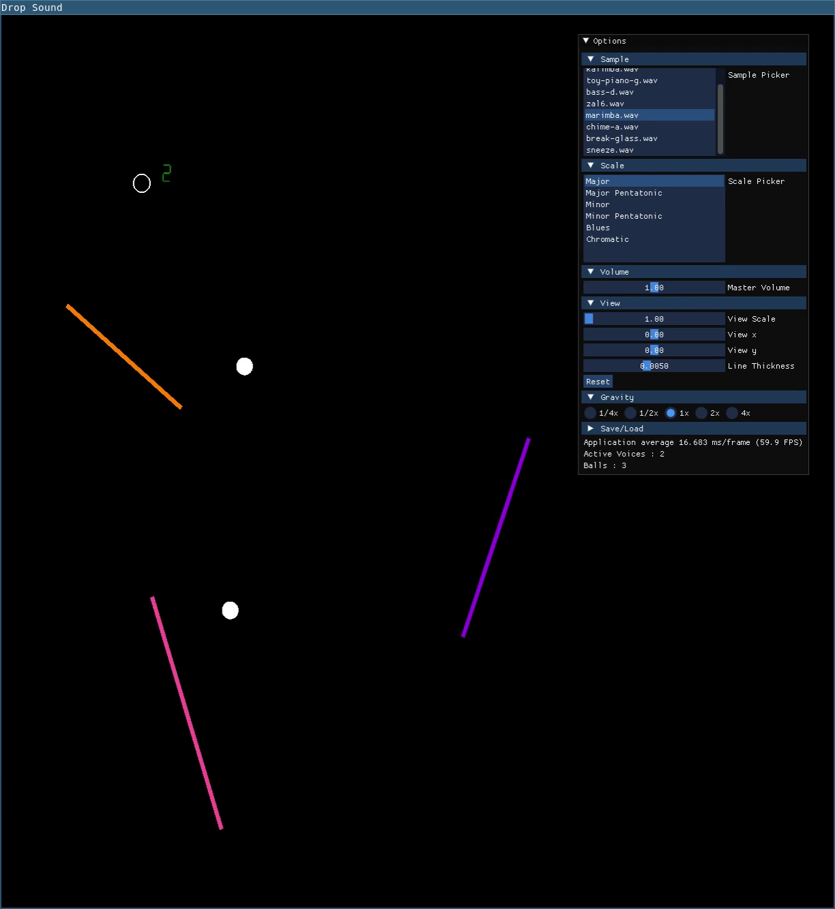
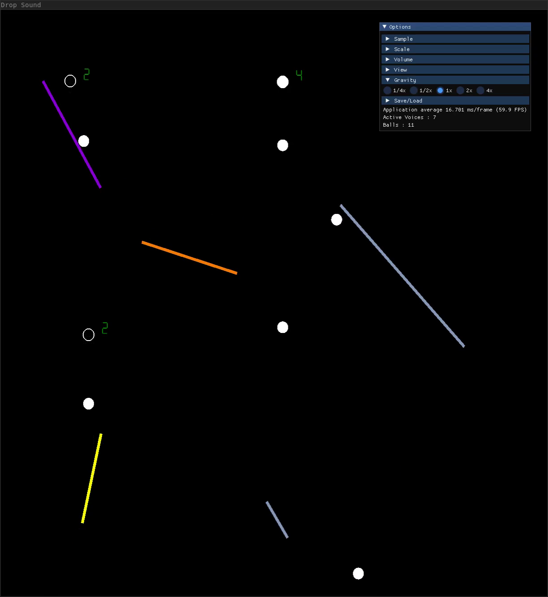

# Sound Drop SD

> A physics based beat synthesizer inspired by the original IOS application **Sound Drop** by **Develoe**

## What is Sound Drop SD?

Sound Drop SD is an OpenGL application built with GLFW & SOLOUD that allows you to generate
musical beats by drawing patterns of lines and spawn points. Balls fall from spawn points and
bounce off lines triggering sounds to play that vary in pitch depending on the length of the line.

## Why was this made?

I built this application primarily for three educational reasons
  - to create a first project in c++
  - to create a first project in opengl
  - to practice integrating open source libraries into a c++ build process

Additionally, I was motivated by
  - the absence of the original project in the IOS marketplace
  - an excuse to incorporate some music theory into a programming project

# Features

- An Undo/Redo stack & save slots to explore variations to the current scene.
- Multiple musical scales that can be applied to your scene to create different sound-scapes.
- Pan & zoom controls to navigate complex pieces.
- A collection of free use audio samples and a system to side load user supplied audio samples.
- A comprehensive Immediate Mode GUI to dial in visual and physical settings.
- Keyboard shortcuts
- Linux/Windows Support

# Planned Features

- An Emscripten web target
- An official debian package release
- An official Windows release target with an MSI.

# Building from Source

## Dependencies

- https://github.com/glfw/glfw
- https://github.com/bkaradzic/GENie
  
---

### Linux

> Pull down git submodules
- `git init submodules`
- `git submodule update`
> Build soloud using GENie and gmake
- `cd soloud/build`
- `genie gmake`
- `cd gmake; make`
> Build locally
- `cd ../../../`
- `make build`

> (Optional) Install
- `sudo make install`
> Which can be undone with
- `sudo make remove`

* I assume you have installed the following packages from apt or equivalent from other package managers
`libglfw3-dev libglfw3`

---

### Windows

Building on Windows requires `Build Tools for Visual Studio 2022` for MSVC.
The build process is nearly identical.

> Acquire glfw3 ( install in this repository )
- `nuget install glfw` ( or equivalent )
> Open a `Visual Studio Developer Command Prompt and build using the windows makefile
- `sudo make --makefile=Makefile.windows`

* if you don't have gmake I recommend installing it with chocolately
- `choco install gmake2`
> Note, you need to add this to your path

---

Running the application

---

`./build/sound-drop.exe`

